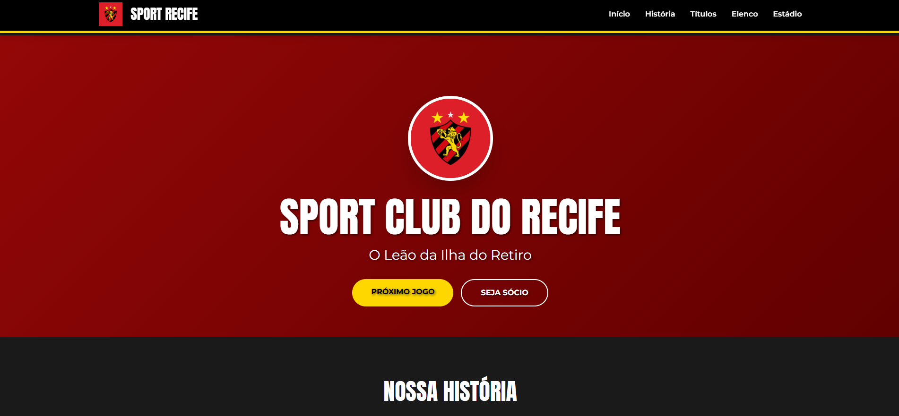

# 🦁 Sport Club do Recife - Homenagem ao Leão da Ilha 🔴⚫

Este site é uma homenagem ao Sport Club do Recife, feita por um torcedor. Ele celebra a história, os ídolos e a paixão do time. O site tem apenas uma página, com design moderno e que funciona bem em qualquer dispositivo.

**[➡️ Ver Projeto Ao Vivo](https://sport-recife.vercel.app/)**

---

### Imagem do Projeto

## 🎯 Sobre o Projeto

O que começou como uma simples página de fã se tornou um projeto completo de desenvolvimento web. O código foi melhorado, separando HTML, CSS e JavaScript. O visual também mudou, passando de um tema claro para um tema escuro com as cores do Sport.

## ✨ Principais Características

* **Design Responsivo:** Funciona bem em computadores, tablets e celulares.
* **Tema Escuro:** Usa as cores preto, vermelho e dourado do Sport.
* **Cabeçalho Dinâmico:** Muda conforme você rola a página.
* **Animações:** Os conteúdos aparecem suavemente enquanto você navega.
* **Menu para Celular:** Fácil de usar em dispositivos móveis.

## 🛠️ Tecnologias Usadas

Este site foi feito com:

* **HTML5:** Para estruturar o conteúdo.
* **CSS3:** Para deixar o site bonito, usando Flexbox, Grid e animações.
* **JavaScript:** Para fazer o site interativo:
    * Controla o menu para celular.
    * Faz o cabeçalho mudar ao rolar a página.
    * Cria as animações de aparecimento.
* **Tailwind CSS:** Para ajudar com o visual.

## 🧠 O Que Aprendi

Durante este projeto, melhorei meus conhecimentos em:

* **Organizar o código** para facilitar mudanças futuras.
* **Melhorar código existente** para ficar mais fácil de entender.
* **Usar JavaScript moderno** sem precisar de bibliotecas extras.

* **Criar uma boa experiência** para quem usa o site.
